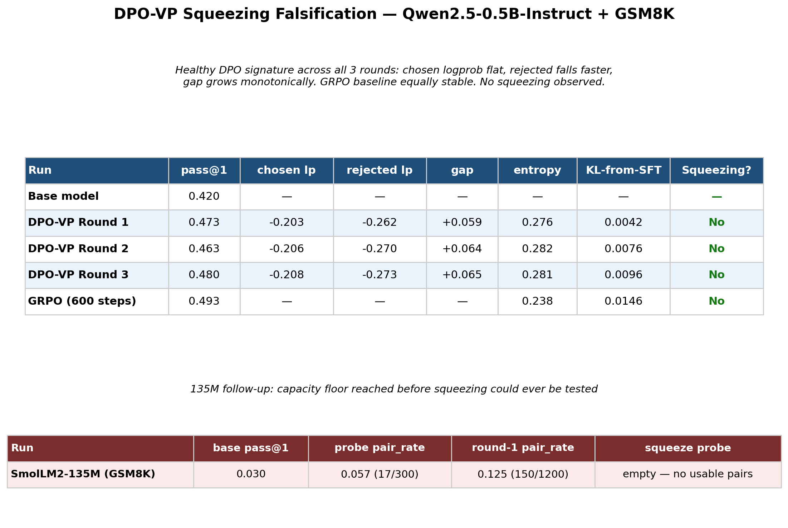

# DPO-VP Squeezing Falsification on Small Language Models

A falsification experiment: does the DPO "squeezing" failure mode — where both
the chosen *and* rejected completion log-probabilities collapse together,
instead of just the rejected one falling — hit sub-1B-parameter language
models earlier or harder than the 7B+ models it's been documented in?

Full write-up of the methodology, run log, and conclusions: [`observations.md`](observations.md).
Background literature: [`literature-review.md`](literature-review.md).

## TL;DR

**Not supported.** Three rounds of iterative DPO with verifiable rewards
(DPO-VP) on Qwen2.5-0.5B-Instruct + GSM8K show the textbook *healthy* DPO
signature, not squeezing: chosen logprob stays flat, rejected logprob falls
faster, and the preference gap grows round over round. A matched GRPO
baseline is equally stable. Pushing to an even smaller model (SmolLM2-135M)
to stress the hypothesis further hit a capacity floor instead — the model
is too weak to even construct correct/incorrect rollout pairs on GSM8K
(3% pass@1), so the squeezing question was never actually tested at that
scale. See [Findings](observations.md#findings) for the full breakdown.



## Method

- **Model:** Qwen2.5-0.5B-Instruct (+ a SmolLM2-135M-Instruct follow-up attempt)
- **Dataset:** GSM8K
- **DPO-VP:** iterative DPO where chosen/rejected pairs come from the model's
  own rollouts, scored against the ground-truth verifier (correct → chosen,
  incorrect → rejected), 3 rounds
- **Baseline:** GRPO (online RL with the same verifiable reward) at matched
  compute
- **Tracked throughout training (not just final accuracy):** chosen/rejected
  logprob and gap on a fixed probe set, entropy, KL-divergence from the
  original SFT model, pass@1, rollout pair rate

## Repo layout

```
src/
  data.py           GSM8K loading, prompt formatting, answer matching
  rollout.py        rollout generation, pass@1 eval, pair construction
  probe_utils.py     logprob/entropy/KL computation shared by both probes
  squeeze_probe.py  SqueezeProbe (DPO) and PolicyProbe (GRPO) TrainerCallbacks
experiments/
  dpo_vp.py          iterative DPO-VP training loop
  grpo_baseline.py   GRPO baseline training loop
run_fast.sh          0.5B run (DPO-VP 3 rounds + GRPO baseline)
run_135m.sh          135M follow-up run (DPO-VP only)
results/             result JSON + cached rollout/probe pairs per run
observations.md      full experiment log, run-by-run results, and findings
literature-review.md background on DPO squeezing and verifiable rewards
make_summary_table.py  generates results_summary.png from the final numbers
results_summary.png    results table image used to share this experiment
```

## Running it

Needs a CUDA GPU (developed on an RTX 4090 24GB pod). From the project root:

```bash
pip install -r requirements.txt
./run_fast.sh      # Qwen2.5-0.5B: DPO-VP (3 rounds) + GRPO baseline
./run_135m.sh      # SmolLM2-135M follow-up (DPO-VP only)
```

Results land in `results/<run_name>/results.json`, with cached intermediate
rollouts/pairs alongside for crash recovery.
